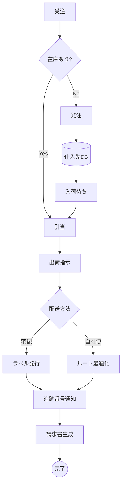
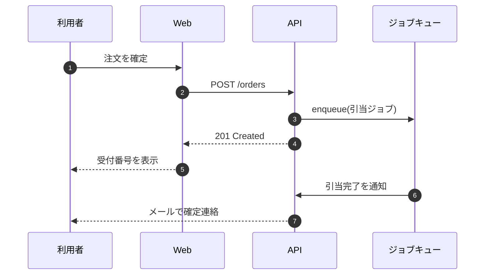

# サンプル

`mmv examples/sample.md` で開けます。図が2つあるのでヘッダのページャで切り替えられます。

## 受注フロー

```mermaid
graph TD
  A[受注] --> B{在庫あり?}
  B -- Yes --> C[引当]
  B -- No --> D[発注]
  D --> E[(仕入先DB)]
  E --> F[入荷待ち]
  F --> C
  C --> G[出荷指示]
  G --> H{配送方法}
  H -- 宅配 --> I[ラベル発行]
  H -- 自社便 --> J[ルート最適化]
  I --> K[追跡番号通知]
  J --> K
  K --> L[請求書生成]
  L --> M((完了))
```

## API シーケンス

```mermaid
sequenceDiagram
  autonumber
  participant U as 利用者
  participant W as Web
  participant S as API
  participant Q as ジョブキュー
  U->>W: 注文を確定
  W->>S: POST /orders
  S->>Q: enqueue(引当ジョブ)
  S-->>W: 201 Created
  W-->>U: 受付番号を表示
  Q->>S: 引当完了を通知
  S-->>U: メールで確定連絡
```
